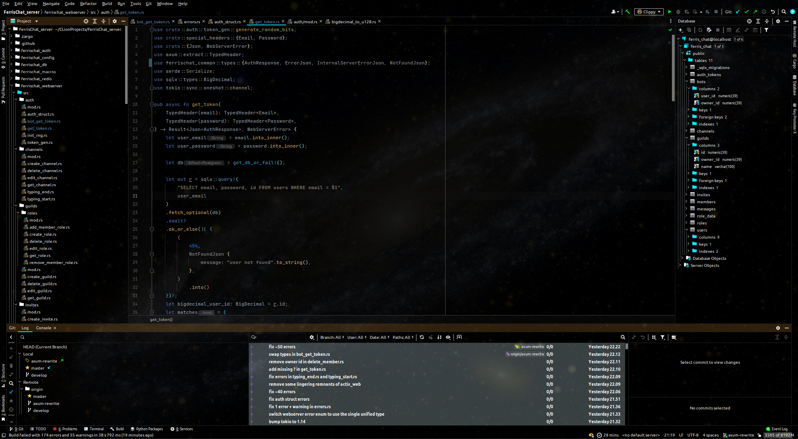

# JetBlack for JetBrains IDEs

Recently one of my plugins for a dark theme broke, and I cannot stand the default Darcula theme.

So out came this little thing.

It's mostly grayscale for colors and styles, but there are pops of color throughout.

Editor styles are also changed, but no language styles are changed (except for VCS diffs).
This may mean for some languages you may need to change the color for accents/highlights in IDE settings.

Contrast is extremely high in most text, since background is rgb(0,0,0) and foreground is rgb(255,255,255).

You want pictures don't you? 

## Installation

- Using IDE built-in plugin system:

  <kbd>Settings/Preferences</kbd> > <kbd>Plugins</kbd> > <kbd>Marketplace</kbd> > <kbd>Search for "JetBlack"</kbd> >
  <kbd>Install Plugin</kbd>

- Manually:

  Download the [latest release](https://github.com/tazz4843/JetBlack-IntelliJ/releases/latest) and install it manually using
  <kbd>Settings/Preferences</kbd> > <kbd>Plugins</kbd> > <kbd>⚙️</kbd> > <kbd>Install plugin from disk...</kbd>

